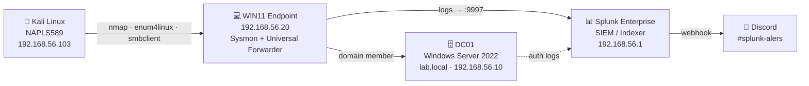
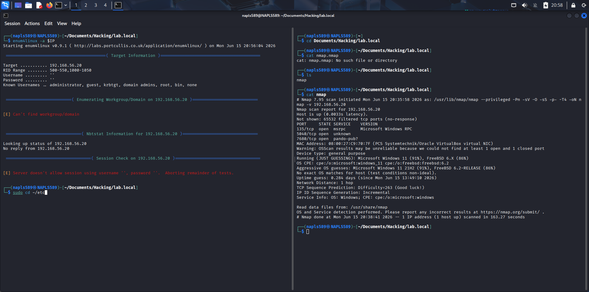

# 🛡️ Purple Team Detection Engineering Lab

> A self-built Active Directory environment for **emulating adversary behavior, engineering detections, and automating real-time SOC alerting** — covering the full security-operations lifecycle from telemetry collection to Discord notification.

This lab demonstrates the complete SOC analyst workflow end to end: stand up the enterprise, attack it, detect the attack, and alert on it — with hands-on red-team tradecraft that bridges toward offensive security.

---

## 🔭 What this demonstrates

- **Detection engineering** — authored 5 original Splunk detections mapped to MITRE ATT&CK
- **SIEM operations** — Sysmon + Windows telemetry pipeline into Splunk via Universal Forwarder
- **Adversary emulation** — Atomic Red Team + live Kali attacks (nmap, enum4linux, smbclient)
- **Incident attribution** — captured a live attacker's source IP and account from failed-logon data
- **SOAR-style alerting** — automated Splunk → Discord webhook notifications to a SOC channel
- **Infrastructure troubleshooting** — diagnosed real firewall, indexing, and deployment issues

---

## 🏗️ Architecture



| Host | Role | OS | Lab IP |
|------|------|-----|--------|
| **DC01** | Domain Controller / DNS | Windows Server 2022 | `192.168.56.10` |
| **WIN11** | Endpoint (victim) | Windows 11 Pro | `192.168.56.20` |
| **Splunk** | SIEM / Indexer | Host | `192.168.56.1` |
| **NAPLS589** | Attacker | Kali Linux | `192.168.56.103` |

**Domain:** `lab.local` (NetBIOS `LAB`) · **OUs:** HR, IT, Finance · **Network:** isolated host-only `192.168.56.0/24`


---

## 🛰️ Telemetry Pipeline

**Sysmon** (SwiftOnSecurity config) + **Windows Event Logs** (Security / System / PowerShell) → **Splunk Universal Forwarder** → indexer on `:9997` → **`sysmon`** & **`windows`** indexes, parsed by the Splunk Add-ons for Windows and Sysmon.


---

## 🎯 Attack → Detection Matrix

| # | Technique | ATT&CK | Attacker Action | Splunk Detection |
|---|-----------|--------|-----------------|------------------|
| 1 | PowerShell execution | **T1059.001** | Atomic Red Team (SOAPHound, SharpHound, encoded cmds) | `PurpleTeam_AtomicRedTeam_Event-Detection` |
| 2 | Network Service Discovery | **T1046** | `nmap` scan from Kali | `PurpleTeam_Network_Recon_Detection` |
| 3 | Network Share Discovery | **T1135** | `enum4linux` / `smbclient` | `PurpleTeam_Share_Enumeration_Detection` |
| 4 | Brute Force / Valid Accounts | **T1110 / T1078** | Failed logons from Kali | `PurpleTeam_Failed_Logon_Detection` |
| 5 | Remote Services | **T1021** | Network (Type 3) logons | `PurpleTeam_Network_Logon_Detection` |


---

## 🔴 Red Team Highlights

**Reconnaissance & enumeration** from Kali — `nmap` service/OS scan and `enum4linux` domain enumeration (recovered the `LAB` domain name and host details):



**Adversary emulation** — Atomic Red Team T1059.001 PowerShell tests executed on the endpoint:


---

## 🔵 Blue Team Highlights

**PowerShell execution detection** correlating Sysmon process events against Atomic Red Team command lines — **fired 122 times**, attributed to `LAB\Administrator` on `WIN11`:

```spl
index=* EventCode=1 ComputerName=WIN11.lab.local CommandLine="*T1059*"
| table _time Image CommandLine User
```


**Live attacker capture** — failed-logon detection recovered the Kali host's source IP (`192.168.56.103`) and the account used:

```spl
index=* EventCode=4625
| table _time Source_Network_Address Account_Name Failure_Reason
| sort -_time
```


---

## 🔔 Automated Alerting: Splunk → Discord

Every detection runs on a cron schedule and pushes a **webhook alert** to a dedicated Discord SOC channel (`#splunk-alers`), rendering structured **"Splunk Alert Triggered!"** notifications with the alert name, owner, and a deep link to the results — closing the loop from telemetry to real-time analyst notification.


---

## 🧰 Tech Stack

`Windows Server 2022` · `Windows 11` · `Active Directory` · `Kali Linux` · `Sysmon` · `Splunk Enterprise` · `Splunk Universal Forwarder` · `Atomic Red Team` · `nmap` · `enum4linux` · `Discord Webhooks` · `MITRE ATT&CK` · `VirtualBox`

---

## 🧗 Engineering Challenges Solved

- **Forwarder blocked at the host firewall** — isolated to the host-only network being on the "Public" profile; fixed with an all-profiles inbound rule for `:9997`.
- **Sysmon data silently dropped** — root-caused to case-sensitive index routing (`index = Sysmon` vs `sysmon`); validated the fix with `btool`.
- **Windows 11 lab deployment** — worked through VirtualBox unattended-install failures, TPM 2.0/EFI requirements, and offline local-account creation.

---

## 📂 Repository Structure

```
purple-team-detection-lab/
├── README.md
├── reports/
│   └── Purple_Team_Detection_Lab_Report.md   # full engagement report
├── detections/
│   └── splunk/                               # saved-search SPL
├── screenshots/                              # all evidence images
└── docs/                                     # setup notes
```

---

## 📄 Full Report

See **[`reports/Purple_Team_Detection_Lab_Report.md`](reports/Purple_Team_Detection_Lab_Report.md)** for the complete engagement writeup — architecture, attack execution, detection logic, ATT&CK coverage, results, and challenges.

---

## 👤 Author

**Jose Angel Rodriguez** — Cybersecurity Analyst (SOC / DFIR / Detection Engineering)
*This lab was built end-to-end as a hands-on demonstration of the detection lifecycle.*
